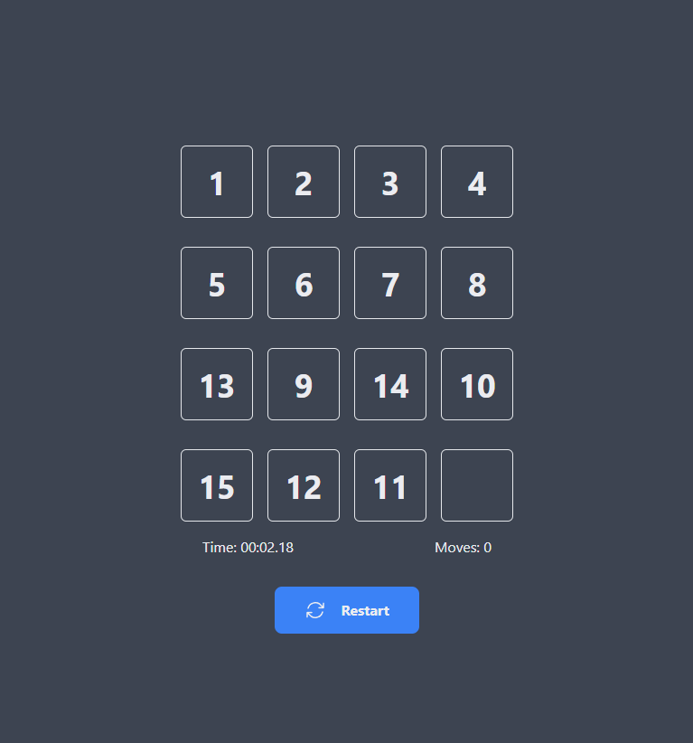

# 15 Puzzle Game with Vue 3 and Tailwind

A nice and simpe game where the objective is put the tile numbers in ascending order using the empty tile to move them arround. You can play using keyboard arrows or just by clicking on the tile you want to move. The game count the quantity of moves you make and the time it takes you to complete it.

Author

Lucas Peruchi Pereira

Project Installation and Compilation

* npm install
* npm run dev

Link of the game if you want to give it a go and test your skills:

Have fun!! 
=) 