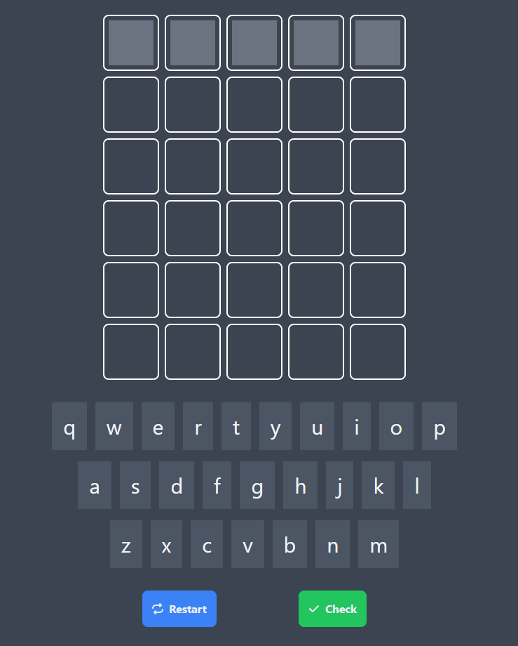

# Teermo with Vue 3 and Tailwind

A simple and enjoyable game where the objective is to guess a five-letter word in 6 tries. When finding an existing letter in the word it will display the color blue, if it is in the correct position the color green and if it does not exist the color red.

Author

* **[Lucas Peruchi Pereira](https://github.com/LucasPeruchi)**

Project Installation and Compilation

* npm install
* npm run dev

Link of the game if you want to give it a go and test your skills: [Teermo](https://puzzle-game-15.firebaseapp.com)

Have fun!! 
=) 
